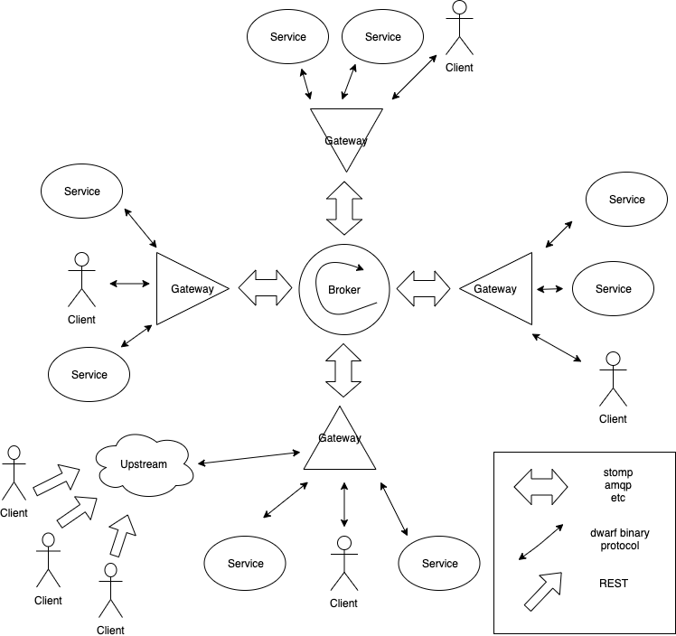

RedDwarf
========
microservice framework

# Sections

* [Overview](#overview)
* [General schema](#general-schema)
* [Supported languages](#supported-languages)
* [Supported message brokers](#supported-message-brokers)
* [How to try](#how-to-try)
  * [Required](#required)
  * [Start core components](#start-core-components)
    * [With local broker](#with-local-broker)
    * [With redis broker](#with-redis-broker)
  * [Open monitor](#open-monitor)
  * [REST access](#rest-access)
  * [Stop core components](#stop-core-components)
* [Core components](#core-components)
  * [Gateway](#gateway)
    * [Wherefore](#wherefore)
  * [Monitor](#monitor)
    * [Wherefore](#wherefore-1)
  * [Upstream](#upstream)
    * [Wherefore](#wherefore-2)
* [Welcome](#welcome)

# Overview

The goal of this framework is to create a convenient and flexible platform for developing microservices in different languages.

# General schema



# Supported languages

  - [Example Node.js (Typescript)](packages/demo-typescript/readme.md)
  - [Example Node.js (Javascript)](packages/demo-nodejs/readme.md)
  - ...


# Supported message brokers

  - local
  - redis
  - ...


# How to try

## Required

 - docker
 - docker-compose
 - make


## Start core components

## With local broker

```sh
make build
make start
```

## With redis broker

```sh
make build-redis
make start-redis
```


## Open monitor

Open `http://localhost:38081/`

or

```sh
make monitor
```


## REST access

Open `http://localhost:38082/upstream/dwarf-demo/rreverse?str=hello`

or

```sh
curl "http://localhost:38082/upstream/dwarf-demo/reverse?str=Hello"
```


## Stop core components

```sh
make stop
```

or

```sh
make stop-redis
```

# Core components


## Gateway


### Wherefore

  * single entry point
  * simple protocol for accessing different message brokers


[Dwarf-gateway](packages/gateway/readme.md)


## Monitor


### Wherefore

  * сonvenient graphical interface to the system
  * quick health check of microservices


[Dwarf-monitor](packages/monitor/readme.md)


## Upstream


### Wherefore

  * microservices have REST protocol support out of the box


[Dwarf-upstream](packages/upstream/readme.md)


# Welcome

Contributions Welcome!
